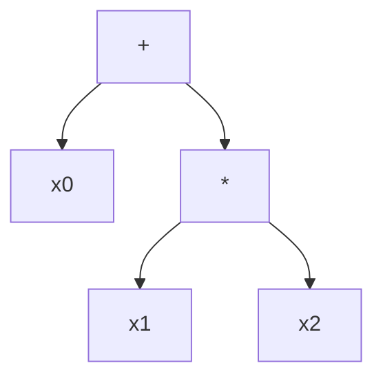

# Breast Cancer example
## Preview
In this example we will solve the Breast Cancer classification problem using our library and Sickit Learn.

## Setting the experiment
First, we will need to import the parts we would want to use in our experiment,
if you are not familiar with the information of the basic parts we recommend reading
My first evolution experiment tutorial [here]().
```python
from time import time
from sklearn.datasets import load_breast_cancer
from sklearn.metrics import accuracy_score
from sklearn.model_selection import train_test_split
from eckity.algorithms.simple_evolution import SimpleEvolution
from eckity.sklearn_compatible.sk_classifier import SkClassifier
from eckity.breeders.simple_breeder import SimpleBreeder
from eckity.creators.gp_creators.ramped_hh import RampedHalfAndHalfCreator
from eckity.genetic_encodings.gp.tree.functions import f_add, f_mul, f_sub, f_div, f_neg, f_sqrt, f_log, f_abs, f_inv, f_max, f_min
from eckity.genetic_encodings.gp.tree.utils import create_terminal_set
from eckity.genetic_operators.crossovers.subtree_crossover import SubtreeCrossover
from eckity.genetic_operators.mutations.subtree_mutation import SubtreeMutation
from eckity.genetic_operators.selections.tournament_selection import TournamentSelection
from eckity.statistics.best_avg_worst_size_tree_statistics import BestAverageWorstSizeTreeStatistics
from eckity.subpopulation import Subpopulation
from eckity.termination_checkers.threshold_from_target_termination_checker import ThresholdFromTargetTerminationChecker

# Adding your own functions
from eckity.sklearn_compatible.classification_evaluator import ClassificationEvaluator
```
Now we can create our experiment, first we will the create the functions and the terminals sets, in addition
we will create our dataset using SKlearn.
### Creating the tree node sets and database
```python
X, y = load_breast_cancer(return_X_y=True)

    # Automatically generate a terminal set.
    # Since there are 5 features, set terminal_set to: ['x0', 'x1', 'x2', ..., 'x9']
    terminal_set = create_terminal_set(X)

    # Define function set
    function_set = [f_add, f_mul, f_sub, f_div, f_sqrt, f_log, f_abs, f_neg, f_inv, f_max, f_min]
```
Our tree individuals will contain some common mathematical functions as internal nodes (function set)
and its leavess (terminal set) will be the vars x0, x1, ..., x9 since we generated them using _create_terminal_set(X)_ 
on the features vector.
We created the database using _load_breast_cancer_ from sickit learn which you can read more about [here](https://scikit-learn.org/stable/modules/generated/sklearn.datasets.load_breast_cancer.html).

An example a possible individual:

## Initializing the Evolution
The Evolution object is the main part of the experiment, it gets the parameters of
the experiment and runs the evolution process.

Here is the code that sets it:
```python
algo = SimpleEvolution(
        Subpopulation(creators=RampedHalfAndHalfCreator(init_depth=(2, 4),
                                                        terminal_set=terminal_set,
                                                        function_set=function_set,
                                                        bloat_weight=0.0001),
                      population_size=1000,
                      evaluator=ClassificationEvaluator(),
                      # maximization problem (fitness is accuracy), so higher fitness is better
                      higher_is_better=True,
                      elitism_rate=0.05,
                      # genetic operators sequence to be applied in each generation
                      operators_sequence=[
                          SubtreeCrossover(probability=0.9, arity=2),
                          SubtreeMutation(probability=0.2, arity=1)
                      ],
                      selection_methods=[
                          # (selection method, selection probability) tuple
                          (TournamentSelection(tournament_size=4, higher_is_better=True), 1)
                      ]
                      ),
        breeder=SimpleBreeder(),
        max_workers=1,
        max_generation=1000,
        # optimal fitness is 1, evolution ("training") process will be finished when best fitness <= threshold
        termination_checker=ThresholdFromTargetTerminationChecker(optimal=1, threshold=0.03),
        statistics=BestAverageWorstSizeTreeStatistics()
    )
```
Lets breakdown its parts and understand the meaning of them:
## Initializing Subpopulation
Subpopulation is the object which holds the individuals, and the objects that are
responsible for treating them (A Population can include a list of several
Sub-populations, but it is not needed in our case)

### Creating individuals
Here we determined the parameters for the creation of the individuals. We have chosen to
create ramped half and half trees with init depth of 2 to 4, we set the
tree nodes' sets to be the ones we created before, we added bloat values in order to
slow down the trees growth, and we chose our population to contain 1000 individuals.
```python
Subpopulation(creators=RampedHalfAndHalfCreator(init_depth=(2, 4),
                                                        terminal_set=terminal_set,
                                                        function_set=function_set,
                                                        bloat_weight=0.0001),
                      population_size=1000,
```
### Evaluating individuals
Next we set the parameters for evaluation the individuals, we will elaborate on this
later in this example.
```python
              # user-defined fitness evaluation method
              evaluator=ClassificationEvaluator(),
              # maximization problem (fitness is accuracy), so higher fitness is better
              higher_is_better=True,
```
### Breeding process
Now we will set the parameters for the breeding process, we chose an elitism rate that determines what percent of the best population's individuals 
will be copied as-is to the next generation in each generation.

Then, we defined genetic operators to be applied in each generation:
* Subtree Crossover with a probability of 90%
* Subtree Mutation with a probability of 20%
* Tournament Selection with a probability of 1 and with tournament size of 4
```python
              elitism_rate=0.05,
              # genetic operators sequence to be applied in each generation
              operators_sequence=[
                  SubtreeCrossover(probability=0.9, arity=2),
                  SubtreeMutation(probability=0.2, arity=1)
              ],
              selection_methods=[
                  # (selection method, selection probability) tuple
                  (TournamentSelection(tournament_size=4, higher_is_better=True), 1)]),
              )
```
We define our breeder to be the standard simple Breeder (which fits to the simple case - 1 sub-population only),
and our max number of worker nodes to compute the fitness values is 1.
```python
        breeder=SimpleBreeder(),
        max_workers=1,
```
### Termination condition and Statistics
We define max number of generations (iterations).
The Algorithm could perform early termination upon reaching fitness value such that:
`|current fitness - optimal_fitness| <= threshold`
```python
        max_generation=1000,
        termination_checker=ThresholdFromTargetTerminationChecker(optimal=1, threshold=0.03),
        statistics=BestAverageWorstSizeTreeStatistics()
    )
```

Finally, we set our statistics to be the default form of best-average-worst-Tree
statistics which prints the next format in each generation of the evolutionary run:
```
generation #(generation number)
subpopulation #(subpopulation number)
best fitness (some fitness which is the best)
worst fitness (some fitness which is average)
average fitness (the average fitness of the individuals)
average size (the average tree size of the individuals) 
```
###runing the experiment
```python
classifier = SkClassifier(algo)

    # split brest cancer dataset to train and test set
    X_train, X_test, y_train, y_test = train_test_split(X, y, test_size=0.2)

    # fit the model (perform evolution process)
    classifier.fit(X_train, y_train)

    # check training set results
    print(f'\nbest pure fitness over training set: {algo.best_of_run_.get_pure_fitness()}')

    # check test set results by computing the accuracy score between the prediction result and the test set result
    test_score = accuracy_score(classifier.predict(X_test), y_test)
    print(f'test score: {test_score}')
```
## Evolution Stage
After setting up the Evolutionary Algorithm, we can finally begin the evolution:
```python
    # evolve the generated initial population
    algo.evolve()
```
## Execution Stage
After the evolve stage has finished (either by exceeding the maximal number of generations or by reaching a
pre-defined threshold), we can execute the algorithm to check the evolution results:
```python
# execute the best individual after the evolution process ends, by assigning numeric values to the variable
# terminals in the tree
print(f'algo.execute(x=2,y=3,z=4): {algo.execute(x=2, y=3, z=4)}')
```

# The Symbolic Regression Evaluator
This is where the magic happends, the Evaluator is the object who evaluate the individual fitness,
so in this place we will choose the direction the evolution will go towards.

###context?
```
### _evaluate_individual
We measure how close an individual to the target function by calculating the mean absolute error between
the true class score (_y_true=self.y_) to the individual score (_y_pred = self.classify_individual(individual))_).
The _classify_individual_ function executes the individual and classify to class 1 or 0 by the CLASSIFICATION_THRESHOLD
which is 0 in our case.

The _individual.execute_ function runs the tree recursively with the given parameters which in our example
will return the individual function result.
```python
def _evaluate_individual(self, individual):
    y_pred = self.classify_individual(individual)
    return accuracy_score(y_true=self.y, y_pred=y_pred)

def classify_individual(self, individual):
    return np.where(individual.execute(self.X) > CLASSIFICATION_THRESHOLD, 1, 0)
```
